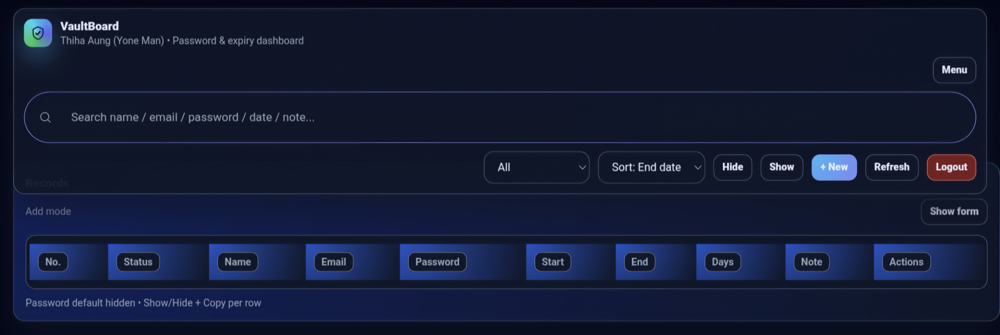

# VaultBoard

> 🔒 Personal use only – not licensed for reuse or redistribution.

Password & expiry dashboard  
(Built for Cloudflare Workers + KV + Pages)

Owner: **Thiha Aung (Yone Man)**

---

## 0. Screenshot

VaultBoard UI screenshot 👇  



---

## 1. Project Overview

**VaultBoard** က password / account တွေကို  
Start / End date နဲ့ status တွေကို စီမံခန့်ခွဲဖို့လုပ်ထားတဲ့ dashboard ဖြစ်ပါတယ်။

ထည့်သိမ်းလို့ရမယ့် field တွေ –

- Name, Email, Password  
- Start date, End date  
- Unlimited / Limited (expiry ရှိ/မရှိ)  
- Note / မှတ်ချက်

Main feature တွေ –

- Password / account တွေကို Excel-like ဇယား UI နဲ့ စာရင်းထားနိုင်တယ်  
- **Status** – ACTIVE / SOON / EXPIRING / EXPIRED / UNLIMITED ကို tag + blinking dot နဲ့ အရောင်ခွဲပြတဲ့ UI  
- **Unlimited mode** – End date မသတ်မှတ်တဲ့ account တွေအတွက်  
- **Search bar** – Name / email / password / date / note အကုန် စုံလင်ရှာနိုင်တယ်  
- **Filter** – All / Active / Expiring (≤7 days) / Expired  
- **Sort** – End date, Updated, Created, Name  
- Password / Email တွေ default မှာ masked ဖြစ်ပြီး per row လိုသလောက် Show / Hide + Copy လုပ်လို့ရတယ်  
- Notifications panel ထဲက Expiring / Expired တွေကို တစ်နေရာတည်း ခွဲပြထားတယ်

**Tech stack**

- Cloudflare **Workers** + **KV** = backend logic + data store  
- Cloudflare **Pages** = UI hosting  
- Plain **HTML + CSS + JavaScript** (no frontend framework)

---

## 2. Cloudflare Setup Summary

### 2.1 KV Store & Env Summary

| Item              | Value / Example          | Note |
| ----------------- | ------------------------ | ---- |
| **KV Namespace**  | `vaultboard_kv`          | Cloudflare Dashboard → **KV** → Create namespace |
| **Binding name**  | `VAULT`                  | `_worker.js` ထဲမှာသုံးတဲ့ binding name. Pages → **Settings → Functions → KV bindings** မှာ ဒီနာမည်နဲ့ ချိတ်ရမယ် |
| **Env variable**  | `ADMIN_PASSWORD`         | Login လုပ်မယ့် admin password. Pages → **Settings → Environment variables** မှာ ထည့်မယ် |
| **Cookie name**   | `sess`                   | `_worker.js` ထဲမှာ hard-coded session cookie name (`sess`) |
| **KV key patterns** | `sess:*`, `index:*`, `rec:*` | Session, index, record data တွေရဲ့ key pattern တွေ |

---

### 2.2 Cloudflare Pages + KV Setup Guide

**Step 1 – KV namespace ဖန်တီးခြင်း**

1. Cloudflare Dashboard → **Workers & Pages** → ဘေးမီနူးမှ **KV** ကိုဝင်  
2. **Create namespace** ကိုနှိပ်  
3. Name ကို `vaultboard_kv` လို့ပေး  
4. Create လုပ်ပြီးသိမ်း

---

**Step 2 – Pages project ကို GitHub repo နဲ့ ချိတ်ခြင်း**

1. Cloudflare Dashboard → **Workers & Pages → Pages → Create a project**  
2. **Connect to Git** ကိုနှိပ်  
3. Git provider အနေနဲ့ GitHub ကိုရွေး  
4. Repo: `vaultboard` (ဒီ project ကိုသိမ်းထားတဲ့ repo)  
5. Branch: `main`

---

**Step 3 – Build settings သတ်မှတ်ခြင်း**

Pages project setup screen မှာ:

- **Framework preset** → `None`  
- **Build command** → *(အလွတ်ထားမယ်)*  
- **Build output directory** → `/`  
- **Root directory (advanced)** → `/` *(default)*  
- **Path** → `/` *(default)*  

ဒီလိုသတ်မှတ်ထားရင် repo root ထဲက `_worker.js` ကို Cloudflare က **Workers for Pages** အနေနဲ့ run လုပ်မယ်။

---

**Step 4 – KV binding ချိတ်ရာ**

1. Pages project detail page ထဲဝင်  
2. **Settings → Functions** (သို့) **Settings → KV namespaces** tab ကိုသွား  
3. **KV namespace bindings** ထဲမှာ **Add binding** ကိုနှိပ်  
   - Variable name: `VAULT`  
   - Namespace: Step 1 မှာဖန်တီးထားတဲ့ `vaultboard_kv`  
4. Save

Worker code ထဲမှာ `env.VAULT` လို့ခေါ်သုံးတဲ့အတွက် Binding name ကို **VAULT** လို့တိတိကျကျထားရမယ်။

---

**Step 5 – Environment variable ထည့်ခြင်း**

1. Pages project → **Settings → Environment variables**  
2. **Add variable** ကိုနှိပ်  
   - Name: `ADMIN_PASSWORD`  
   - Value: ကိုယ် Dashboard ဝင်ဖို့သတ်မှတ်မယ့် strong password (ဥပမာ `Y0neMan!2026`)  
3. Save

Frontend login ပြုလုပ်ရင် ဒီ `ADMIN_PASSWORD` နဲ့ကိုက်ညီရင်သာ ထဲဝင်လို့ရမယ်။

---

**Step 6 – Deploy**

- Settings အကုန်ပြီးသွားရင် “**Save and Deploy**” (သို့) “**Redeploy**” ကိုနှိပ်  
- Build / deploy logs အောင်မြင်သွားရင်  
  production domain (`https://xxx.pages.dev`) မှာ VaultBoard Login UI ပေါ်လာသင့်ပါတယ်။

---

## 3. Repo Structure

GitHub repo structure ကို အောက်ပါပုံစံနဲ့သတ်မှတ်ထားပါတယ် —

```text
vaultboard/
├─ _worker.js   # main Cloudflare Worker + UI code
└─ README.md    # ဒီ guide ဖိုင်
